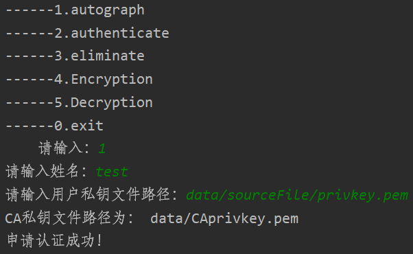
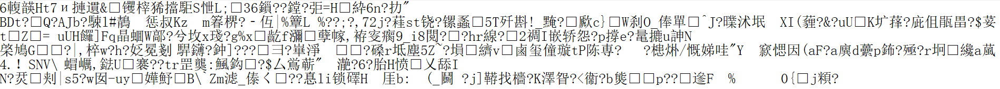
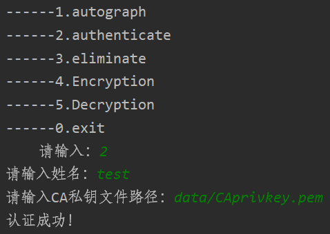
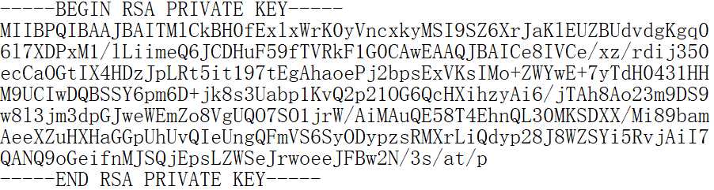
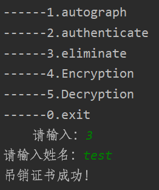
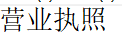
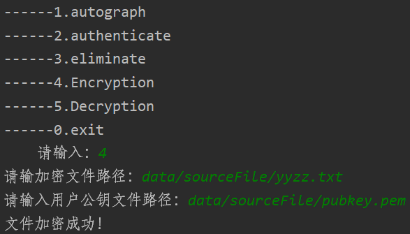
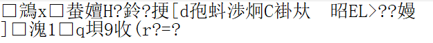
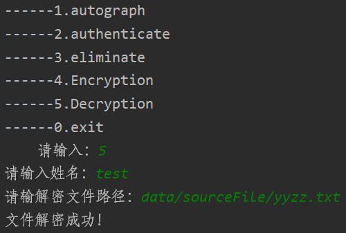

# 信息安全课程设计：CA 系统开发

## 一、题目：CA系统的设计和实现

​        注：CA，Certificate Authority，电子认证服务或机构，为电子签名相关各方提供真实性和可靠性验证，是负责发放和管理数字证书的权威机构，并作为电子商务交易中受信任的第三方，承担公钥体系中公钥的合法性检验责任。

## 二、功能要求：实现一个CA系统

1. 接受用户提交的认证申请，包括用户信息的表单和公钥等，提交时让用户自己产生公钥对；

2. 在对用户实施认证的过程中，储存相应的用户信息，如证书、营业执照的扫描文档等。这些文档应经过安全的加密（加密算法任选）；

3. 给通过认证的用户颁发证书；

4. 用户密钥丢失时，可以吊销证书，密钥作废。

5. 选做且加分项：交互友好的程序界面。

## 三、性能要求

1. 能抵抗大多数的常见攻击，如重放攻击、生日攻击、字典攻击等。

2. 对该系统进行详细测试，给出测试用例或方案，并以实验的方式给出该系统针对上述攻击的结果。详细的测试和实验是评分的重要依据。

3. 选做且加分项：1)测试数据可来自真实测试集；2)可自拟客观指标对测试结果进行衡量；3)对测试结果可进行加密位数、密钥空间、攻击时空复杂性等数学分析或算法分析；4)针对测试结果可改进该系统。

## 四、文件介绍

1. `data` 文件夹：存放系统生成数据的文件夹；
2. `.pem` 文件：用户的公钥、私钥文件；
3. `data/sourceFile` 文件夹：存放用户原始数据的文件夹，若使用到加解密功能则会直接对文件进行更改；
4. `yyzz.txt` 文件：一个简单的营业执照示例，用于测试代码；
5. `config.py` 文件：内置了系统需要用到或生成的文件路径，可根据需要自行更改。

## 五、使用

如果图像显示失效，请将项目下载到本地并查看 `README.md` 文件。

由于系统较为简陋，没有考虑多用户的实际使用情况，因此不建议创建多个用户进行测试。如果您有兴趣，可自行修改代码并对本仓库做出贡献！

### 1. 签名

* 用户使用 CA 系统的签名功能；

* 运行 `run.py` ，按下述步骤进行交互：

  

* 运行后系统生成系统公私钥文件，并对用户私钥进行签名；

* 此时系统可以将系统公钥 `data/CApubkey.pem` 公开，系统私钥 `data/CAprivkey.pem` 通过可靠的方式告知其他用户；

* 签名后的用户私钥为 `data/test.pem` ：

  

### 2. 认证

* 用户 2 持有 CA 系统签发的系统私钥，可对系统进行认证；

* 运行 `run.py` ，按下述步骤进行交互：

  

* 认证后的用户公钥文件如下所示 `data/test.pem` ：

  

* 可以发现认证后的文件与用户私钥一致；

### 3. 吊销证书

* 特别提醒，此步骤应在加解密文件操作之后使用（因为文件解密会使用到证书）；

* 就是删除系统中有关某用户签名或认证的文件；

* 运行 `run.py` ，按下述步骤进行交互：

  

### 4. 加密

* 使用用户公钥对 `data/sourceFile/yyzz.txt` 文件进行加密，原文件内容如下：

  

* 运行 `run.py` ，按下述步骤进行交互：

  

* 加密后的 `yyzz.txt` 文件如下所示：

  

### 5. 解密

* 使用 CA 系统通过用户登录的方式来工作，系统会自行核验用户身份，若通过则使用系统密钥与用户密钥对文件进行解密。

* 运行 `run.py` ，按下述步骤进行交互：

  

* 解密后的 `yyzz.txt` 文件如下所示：

  
